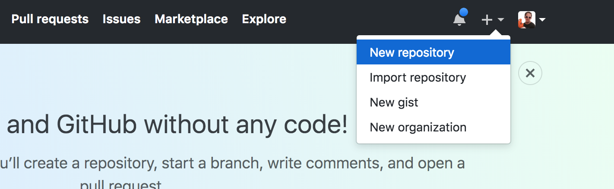
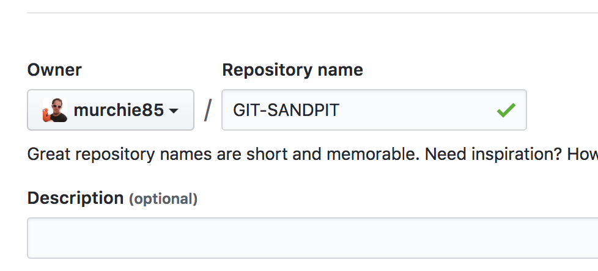

# Hands on Working with github

LAB1-GIT |
[LAB2-JENKINS ](../LAB2-JENKINS/README.md) |
[LAB3-AWS](../LAB3-AWS/README.md) |
[Home](../README.md) 

Github is a source code management tool - which is the foundation of all development practices, it is basically like dropbox for your code, bare minimum people upload their code here as a backup, you can also collaborate with others, share code, contribute to their code etc. 

The general best practices approach is: 

1. __Download__ and Install git on your computer
2. Make sure it works by opening command line or terminal and typing GIT
3. On your computer have a folder where you will do your coding projects (my folder is just called projects).
4. In the projects folder, have a folder for __subproject__ like myAWSCourse.
5. __DO NOT__ group your folders by languages i.e. Java folder, Python folder.
6. Now each folder will store a gitreference (we can worry about that later) - but it means you don't have to complete any of them to feel a sense of achievement.


Finally before we start, you should know this page that you are reading is a github standard approach. Every github repo has a readme.md file (.md is a format like .txt or .doc but when uploaded into github it auto formats and you can do things like make text __bold__ _italic_ etc more on this later).


# LESSON 1 - CREATE A GIT REPO


Lets get right into it: 

1. First create a subfolder on your computer for this lesson, you can call it __GIT-SANDPIT__
2. In this folder make add some __random files__
3. Also make a __README.md__ file, open it up and write `# GIT Sandpit` , then save and close. 

Log into Github and click the plus arrow in the top right to create a new repository: 



Now give your repository a name (like below), if the initialize repo with README.md is ticked, unselect it - we want to get in the habbit of doing this ourselves and we have made one already in our folder. 



You will see a list of commands to run, but follow the commands below, they are similiar to what you get prompted with but some slight changes - I will explain each step after the # sign, these are comments so ignore them and don't paste them in. 

```
cd myprojectfolderdirectory                  # THIS HAS TO BE THE BASE DIRECTORY OF YOUR SUB PROJECT FOLDER i.e. AWStutorial
git init                                     # This will add hidden files to your folder (they are git tracking files)
git add .                                    # The . at the end means add everything
git commit -m "Any message you like"         # -m means message, when you do this commit its ready to get uploaded
git remote add origin yourgithubrepolink/    # You will only do this once, just copy this line from the git page and run it
git push -u origin master                    # This will now upload your files to git

```


If this all works correctly, refresh the gitpage that you were on showing the list of commands and you will see your stuff there.


# GIT LIKE A BOSS


Ok now you have your files uploaded, you don't need to do all those steps above, to update the files you just run three commands. I will talk you through it, we will make changes a couple of times so you get the idea. 

## BTC Reporting

We will add a file that when we run it, it gives us a list of all crypto coins and their BTC value. The steps we will do to get the hang of it are simple and are:

### SECOND GIT UPLOAD

* Create a file in your subfolder GIT-SANDPIT called __BTCREPORT.ps__
* On command line navigate to the base of your __GIT-SANDPIT__ and follow these next command steps

```
git add . 
git commit -m 'created new file'
git push origin master 
```

That should be uploaded now, open your github repo in your browser to check it was uploaded succesfully. 


### THIRD UPLOAD

Now we will just add some code to our BTCREPORT.ps file then upload it again for fun 

Paste the below code into your __BTCREPORT.ps__ file 

```
$url = "https://api.coinmarketcap.com/v1/ticker/?convert=GBP"


#this bit of code will pull data from coinmarketcap into a json file that we could parse or do reporting on.

Invoke-WebRequest -Uri $url -UseDefaultCredentials | Select-Object -ExpandProperty content > output.json

```

* Save and close the file
* Now lets upload again using the same steps. 

```
git add . 
git commit -m 'created new file'
git push origin master 
```


# FINISHED! 


Ok you are done! now you know everytime you make a change you just do three commands __add__ , __commit__ , __push__ . Remember though, if you upload a new repo, you have to do those initialising steps it tells you.


# HOW TO FORMAT YOUR README.md FILES TO LOOK NICE (EXPAND FOR INFO)
<details>


# # BIG TITLE  

## ## H1 HEADING  

### ### H2 HEADING (and so on)  


To do bullet points, you just use the * then a space 

* bullet 1 
* bullet 2 
* bullet 3 

You can google markdown format or just check the link below for a one pager cheatsheet.  Don't worry about this too much, all you need to know is how to do a title, and bullet points - that will mean all your code folders will have a nice README that will display anytime someone accesses your github repo.
</details>


## Further Reading
1. [MarkDown cheatsheet](https://github.com/adam-p/markdown-here/wiki/Markdown-Cheatsheet)