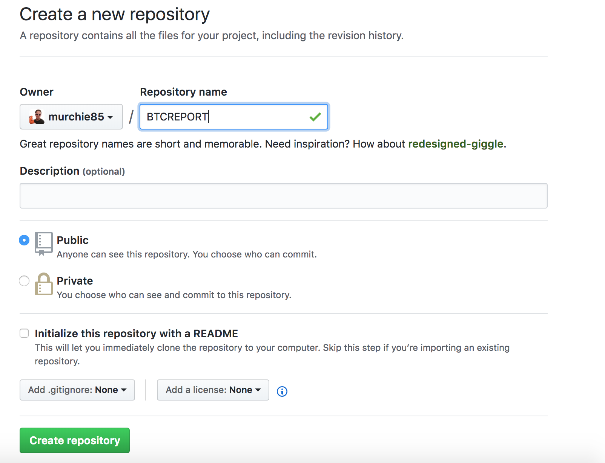

# Hands on Working with github

LAB1-GIT |
[LAB2-JENKINS ](../LAB2-JENKINS/README.md) |
[LAB3-AWS](../LAB3-AWS/README.md) |
[Home](../README.md) 

Github is a source code management tool - which is the foundation of all development practices, it is basically like dropbox for your code, bare minimum people upload their code here as a backup, you can also collaborate with others, share code, contribute to their code etc. 

The general best practices approach is: 

1. On your computer have a folder where you will do your coding projects (my folder is just called projects).
2. In the projects folder, have a folder for sub project like AdamsAWSCourse.
3. __DO NOT__ group your folders by languages i.e. Java folder, Python folder.
4. Now each folder will store a gitreference (we can worry about that later) - but it means you don't have to complete any of them to feel a sense of achievement.


Finally before we start, you should know this page that you are reading is a github standard approach. Every github repo has a readme.md file (.md is a format like .txt or .doc but when uploaded into github it auto formats and you can do things like make text __bold__ _italic_ etc more on this later).


# LESSON 1 - CREATE A GIT REPO

Log into Github and click the plus arrow in the top right to create a new repository: 


Now give your repository a name, if the initialize repo with README.md is ticked, unselect it - we want ot get in the habbit of doing this ourselves. 



Now follow the commands below, they are similiar to what you get prompted with but some slight changes - I will explain each step. 

```
echo "# blah" >> README.md
git init
git add README.md
git commit -m "first commit"
git remote add origin https://github.com/murchie85/blah.git
git push -u origin master

```


# BASIC FORMAT (EXPAND)
<details>


# # BIG TITLE  

## ## H1 HEADING  

### ### H2 HEADING (and so on)  


To do bullet points, you just use the * then a space 

* bullet 1 
* bullet 2 
* bullet 3 

You can google markdown format or just check the link below for a one pager cheatsheet.  Don't worry about this too much, all you need to know is how to do a title, and bullet points - that will mean all your code folders will have a nice README that will display anytime someone accesses your github repo.
</details>


# GIT LIKE A BOSS


What you need to do is: 

1. Download and Install git on your computer
2. Make sure it works by opening command line or terminal and typing GIT
3. create a project folder on your computer where you will start developing from now on, each new project gets its own folder in your projects folder i.e. project/jenkins or project/aws

Once that is sorted the steps you will repeat over and over as you develop (and will make you look like a pro to non developers is this)

1. Write code on your computer
2. do a __ git add . __ on command line, this adds your code ready to upload
3. do a ** git commit -m 'whatever message' ** this preps your code ready for upload
4. do a ** git push origin master ** this uploads your code to github. 

Thats it, so each time you are ready to updload you just do the following __add__ , __commit__ and __push__ jobs a goodun.

## Further Reading
1. [MarkDown cheatsheet](https://github.com/adam-p/markdown-here/wiki/Markdown-Cheatsheet)