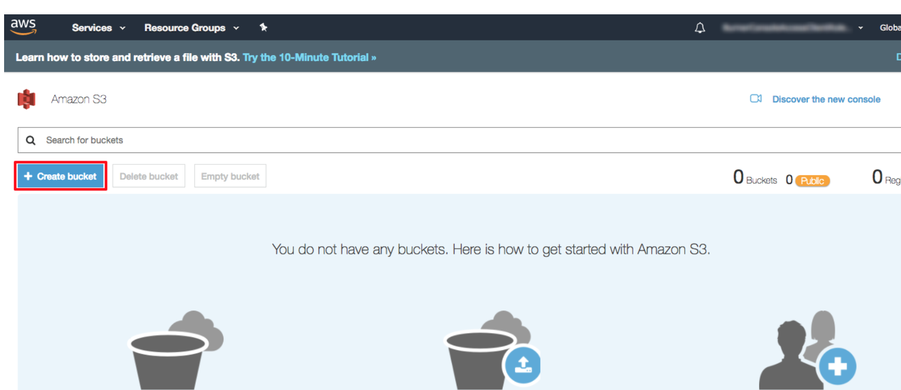
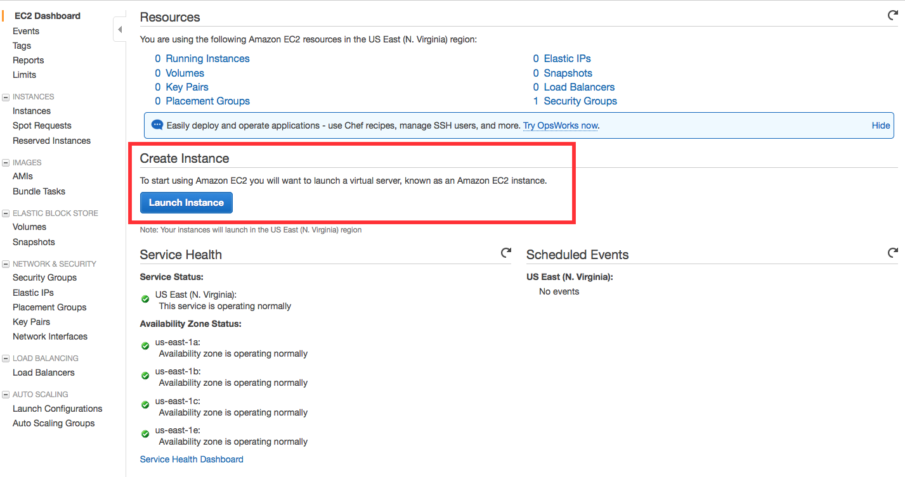
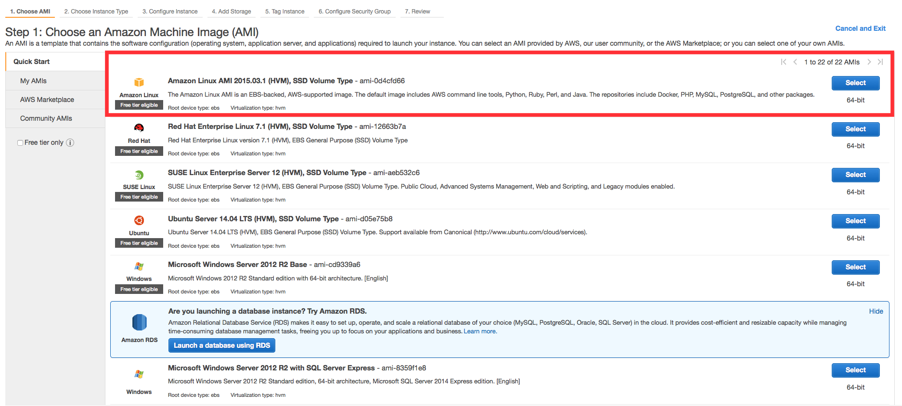
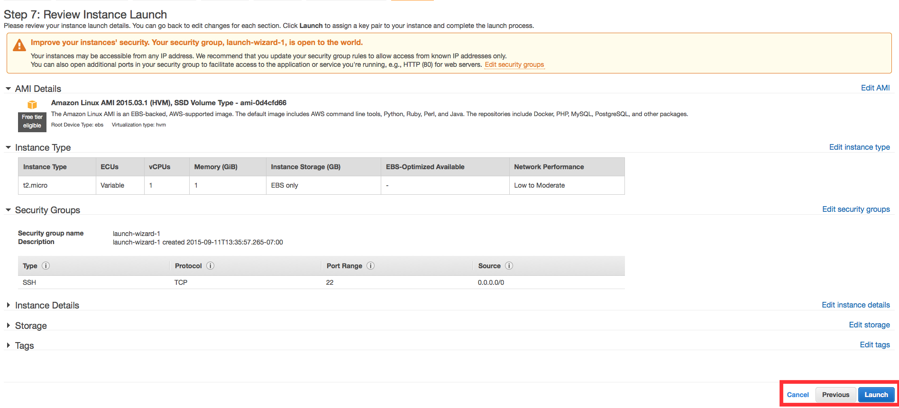

# AWS HANDS ON 

LAB3-AWS |
[LAB1-GIT](../LAB1-GIT/README.md) |
[LAB2-JENKINS](../LAB2-JENKINS/README.md) |
[Home](../README.md) 

This folder contains all the stuff you need to get started with AWS

# LESSON 1 Store and Retrieve a File

1. Enter amazon console 
2. Then type S3 in the search bar and select S3 to open the console.
3. In the S3 dashboard, click Create Bucket.

4. Enter a bucket name. Bucket names must be unique across all existing bucket names in Amazon S3.
5. You have many useful options for your S3 bucket including Versioning, Server Access Logging, Tags, Object-level Logging and Default Encryption. We won't enable them for this tutorial. Select Next.
6. You have the ability to set permission settings for your S3 bucket. Leave the default values and select Next.
7. Review your configuration settings and select Create bucket.

## SUMMARY

I wont explain the obvious, but adding and retreiving files are straight forward and will leave you to find that out. 
__WHY__ is this so useful? Because not only can you hold files here, but you can also host your website in an S3 bucket and server critical components - there is truly a lot of functionality you can do with S3. 

# LESSON 3 Launch a Linux Virtual Machine (WINDOWS steps)

Amazon Elastic Compute Cloud (EC2) is the Amazon Web Service you use to create and run virtual machines in the cloud. These are referred to as instances in AWS and are useful because you can run multiple and loadbalance them, so effectivley you can host a companies entire infrastructure and apps on EC2. 
 Spinning up as demand peaks and contracting down when it's quite to save server costs. 

 1. Search for EC2 and open 
 2. click Launch Instance to create and configure your virtual machine.

 

3. In this screen, you are shown options to choose an Amazon Machine Image (AMI). AMIs are preconfigured server templates you can use to launch an instance. Each AMI includes an operating system, and can also include applications and application servers. but we will find Amazon Linux AMI and click Select.

4. The default option of t2.micro should already be checked and it is free. 
5. Stick with default values on this screen below. 

6. On the next screen you will be asked to choose an existing key pair or create a new key pair. A key pair is used to securely access your Linux instance using SSH. AWS stores the public part of the key pair which is just like a house lock. You download and use the private part of the key pair which is just like a house key. Select __Create a new key pair__ and give it the name __MyKeyPair__. Next click the __Download Key Pair__ button. If you lose your key, its lost and you can't access the instance. 

I recommend saving your key pair in your user directory in a sub-directory called .ssh (ex. C:\user\{yourusername}\.ssh\MyKeyPair.pem).

**Tip:** You can't use Windows Explorer to create a folder with a name that begins with a period unless you also end the folder name with a period. After you enter the name (.ssh.), the final period is removed automatically.

7. After you have stored your key pair, click Launch Instance to start your Linux instance.
8. Click View Instances on the next screen to view your instances and see the status of the instance you have just started. It will take a while to boot up.
9. Copy the Public IP address of your AWS instance
10. Download GitBash [here]](https://git-scm.com/download/win)
11. Right click on your desktop (not on an icon or file) and select Git Bash Here to open a Git Bash command prompt.
12. Use SSH to connect to your instance. In this case the user name is ec2-user, the SSH key is stored in the directory we saved it to in step 2 part d, and the IP address is from step 2 part f. The format is ssh -i {full path of your .pem file} ec2-user@{instance IP address}.
Enter ssh -i 'c:\Users\yourusername\.ssh\MyKeyPair.pem' ec2-user@{IP_Address} (ex. ssh -i 'c:\Users\adamglic\.ssh\MyKeyPair.pem' ec2-user@52.27.212.125)

You'll see a response similar to the following:

The authenticity of host 'ec2-198-51-100-1.compute-1.amazonaws.com (10.254.142.33)' can't be established. RSA key fingerprint is 1f:51:ae:28:df:63:e9:d8:cf:38:5d:87:2d:7b:b8:ca:9f:f5:b1:6f. Are you sure you want to continue connecting (yes/no)?

Type __yes__ and press __enter__

13.You'll see a response similar to the following:

Warning: Permanently added 'ec2-198-51-100-1.compute-1.amazonaws.com' (RSA) to the list of known hosts.

You should then see the welcome screen for your instance and you are now connected to your AWS Linux virtual machine in the cloud.
14. Now go back to view your instance in AWS and terminate it. 
